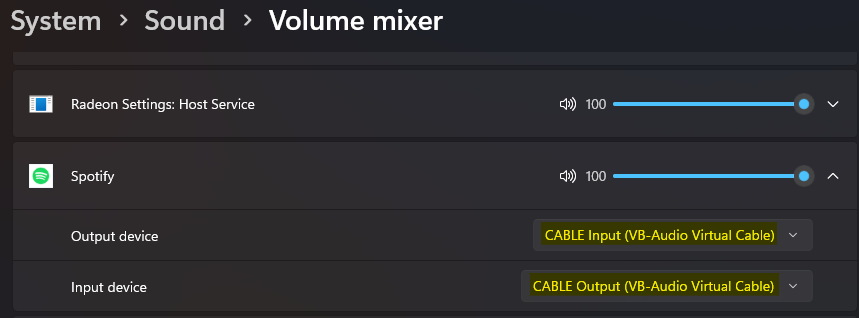

# Audio Splitter


A Python application that allows routing audio to multiple output devices simultaneously on Windows. Perfect for streaming setups or when you need to output audio to both speakers and headphones.

## Requirements

- Windows 10/11
- Python 3.8 or higher
- Virtual Audio Cable (required for routing audio between applications)

## Installation

1. **Install Python Dependencies**
   ```bash
   pip install -r requirements.txt
   ```

2. **Install Virtual Audio Cable**
   - Download VB-Audio Virtual Cable from [https://vb-audio.com/Cable/](https://vb-audio.com/Cable/)
   - Run the installer
   - Restart your computer to ensure the virtual devices are properly initialized

## Setting Up Audio Routing

### System-Wide Audio (All Applications)

To route all system audio through the virtual cable:

1. Open Windows Sound Settings
   - Right-click the speaker icon in the taskbar and select "Sound settings"
   - Or navigate to `System > Sound`

2. Configure the system audio routing:
   - Under "Output", select `CABLE Input (VB-Audio Virtual Cable)`
   - Under "Input", select `CABLE Output (VB-Audio Virtual Cable)`

This will route all system audio through the virtual cable.

### Per-Application Audio Routing

To route specific applications through the virtual cable:

1. Open Windows Sound Settings by right-clicking the speaker icon in the taskbar and selecting "Sound settings"
   - Or navigate to `System > Sound > Volume Mixer`

2. In the Volume Mixer, locate your desired application (e.g., Spotify, Chrome, etc.)

3. Configure the audio routing:
   - Set "Input device" to `CABLE Output (VB-Audio Virtual Cable)`
   - Set "Output device" to `CABLE Input (VB-Audio Virtual Cable)`



This setup allows you to isolate and capture audio from specific applications while other system sounds continue playing through your default output device.

## Usage

1. **First Run**
   ```bash
   python audio_split.py
   ```
   - On first run, you'll be prompted to select your output devices
   - You can choose to create a desktop shortcut for easy access

2. **Configuration**
   The `settings.cfg` file contains your device settings:
   ```ini
   [Devices]
   device_1 = Speakers (Realtek(R) Audio)
   device_2 = Headphones (USB Main Audio)

   [Settings]
   device_count = 2
   input_device = CABLE Output (VB-Audio Virtual Cable)
   sample_rate = 48000
   channels = 2
   frames_per_buffer = 2048
   device_1_volume = 1.0
   device_1_latency = 0.08
   device_2_volume = 1.0
   device_2_latency = 0.0
   ```

   - `volume`: Range 0.0 to 1.0 (0% to 100%)
   - `latency`: Delay in seconds (e.g., 0.08 = 80ms)

3. **Commands**
   - List available devices: `python audio_split.py --list-devices`
   - Reset configuration: `python audio_split.py --reset-config`
   - Show version: `python audio_split.py --version`

4. **Controls**
   - `Ctrl+C`: Stop the application
   - Edit `settings.cfg` to adjust volumes and latency (changes apply immediately)

## Troubleshooting

1. **No Audio Output**
   - Ensure you have selected the `Virtual Cable` as both input and output device in Windows. If you want to apply it per application; use the `Volume Mixer` to route the application to the `Virtual Cable` input and output.
   - Check that the device names in settings.cfg match your system exactly
   - Try resetting the config: `python audio_split.py --reset-config`

2. **Audio Delay**
   - Adjust the latency setting in settings.cfg (lower = less delay, but may cause stuttering)
   - Default latency is 0.0 seconds
   - Try values between 0.05 and 0.1 if experiencing issues
   - After changing `sample_rate`, `channels`, or `frames_per_buffer`, restart the script

3. **Application Crashes**
   - Check the logs in the `logs` directory for error details
   - Ensure all required Python packages are installed
   - Verify your audio devices are properly connected and recognized by Windows

4. **Non-English Device Names / Garbled Text**
   - This project reads/writes `settings.cfg` as UTF-8; ensure you edit the file as UTF-8 as well
   - If the Windows console cannot display device names correctly, run from a terminal configured for UTF-8 (or use the created desktop shortcut)

5. **Echo / Feedback**
   - Avoid selecting `CABLE Input (VB-Audio Virtual Cable)` as an output device inside Audio Splitter unless you explicitly know you need it
   - If you hear echo after changing Windows audio routing, restart the script to reset internal buffers

6. **Volume Too Low / Need 100% On Other Devices**
   - Audio Splitter does not override Windows per-device volume or Volume Mixer settings; it applies only the per-device `device_N_volume` multiplier from `settings.cfg`
   - Check Windows Sound settings for the relevant device levels (including `CABLE Output` recording level if you route through VB-Cable)

## Contributing

Feel free to open issues or submit pull requests on GitHub.

## Development

- Install dev dependencies: `pip install -r requirements-dev.txt`
- Run tests: `pytest`

## License

This project is licensed under the MIT License - see the LICENSE file for details. 
